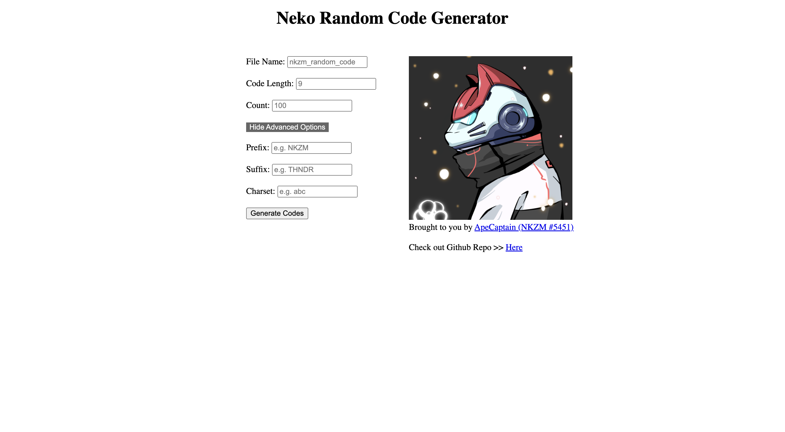

# neko_random_code_generator
An open source project using "randomstring" package (https://www.npmjs.com/package/randomstring) to create an easy to use random code generator, so i called it "Neko Random Code Generator" !
Visit & Use the website here: https://neko-random-code-generator.vercel.app/

## Neko Random Code Generator

Neko Random Code Generator is a simple web application that generates random codes based on user-defined parameters. It provides options for generating codes with prefixes, suffixes, and custom character sets. The generated codes can be saved to a file for further use.



## Features

- Generate random codes with customizable length.
- Include prefixes and suffixes to the generated codes.
- Specify the number of codes to generate.
- Use a custom character set for code generation.
- Save the generated codes to a .xlsx file.

## Usage

1. Enter the desired values for the code generation parameters:
   - **File Name:** Specify the name of the file to save the generated codes.
   - **Code Length:** Set the length of each generated code.
   - **Count:** Define the number of codes to generate.
   - **Show Advanced Options:** Toggle additional options such as prefixes, suffixes, and character set.

2. Click on the "Generate Codes" button to initiate the code generation process.

3. Once the codes are generated, they will be saved to a file with the specified name.

## Installation

To run the Neko Random Code Generator locally, follow these steps:

1. Clone the repository:

   ```bash
   git clone https://github.com/your-username/neko-random-code-generator.git

2. Navigate to the project directory:

    cd neko-random-code-generator

3. Install the dependencies:

    npm install

4. Start the application:

    node index.js
